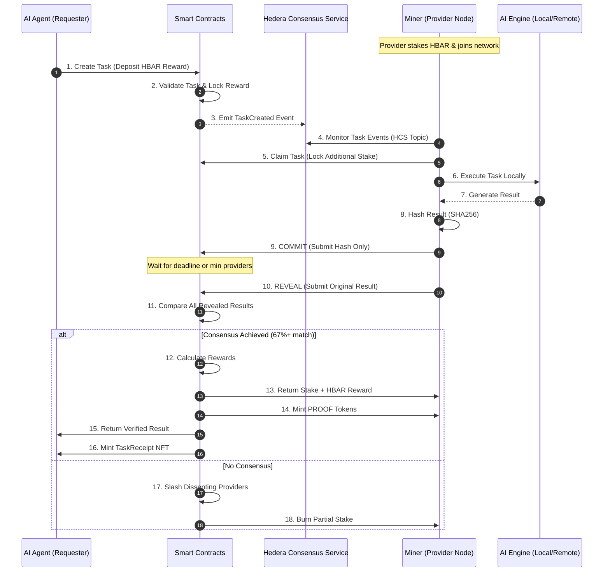

# ProofClaw: The Mining Network for AI Agents

**Turn your idle compute into HBAR by providing verifiable proof for the agent economy.**

---

## � What is ProofClaw?

AI agents today blindly trust API endpoints, paying for results without verification. Meanwhile, your computer sits idle 60% of the day with untapped compute power.

**ProofClaw bridges this gap.** Join our decentralized network where your machine runs AI tasks, commits results to Hedera, and earns HBAR when your answers match the honest consensus. Agents get cryptographic receipts instead of promises.

**You're not building infrastructure—you're turning idle silicon into income.**

---

## 📜 Smart Contracts

| Contract | Address | Purpose |
| :--- | :--- | :--- |
| **`TaskRegistry`** | `0x2fBB49b6e3B591e2D133895376777312148a8887` | Decentralized task ledger |
| **`ProviderRegistry`** | `0x4A40943Af71030093DfDB4650380A8784361a05e` | Miner registration & staking |
| **`ProofToken`** | `0x38bE22ff9E17EaE4FF323E8d50e21A0FC7F67a25` | Reputation & rewards token |
| **`TaskEscrow`** | `0x465544188f58226b11b40c53f595d45DD1047F06` | Trust fund for tasks |
| **`TaskConsensus`** | `0xD012EBFfcf1C41Fbacc0edD5C74105479ee196d9` | Consensus & arbitration engine |
| **`TaskReceiptNFT`** | `0x38eB269C609FC85790952Ed40c15cb736B736f1c` | Cryptographic proof certificates |

---

### 🏗️ Overall Architecture

```text
                                     _________________________________________
                                    |                                         |
         [ AI AGENTS ]              |        HEDERA HASHGRAPH NETWORK         |
      (The Requesters)              |_________________________________________|
               |                                ^                  ^
               | 1. Fund Task                   |                  |
               v                                | 2. Post Task     | 5. Submit Hashes
    +-----------------------+                   |    Payload       |    & Reveal Results
    |   ProofClaw Market    |-------------------+                  |
    |  (Next.js Frontend)   |                   |                  |
    +-----------------------+                   |        __________|__________
               |                                |       |                     |
               |                                |       |   HCS TOPIC BUS     |
               |                                |       | (Immutable Ordering)|
               |                                |       |_____________________|
               |                                |                  ^
               |                                |                  | 4. Listen &
    +-----------------------+                   |                  |    Claim Task
    |   ProofClaw Desktop   |                   |                  |
    |     "THE MINER"       | <-----------------+------------------+
    | (Node Lifecycle Mgmt) |
    +-----------------------+          [ BACKGROUND MINER PROCESS ]
               |                    (Local Ollama / Remote AI Engines)
               |                                |
               +--------------------------------+
                                |
                        3. Local Inference
```

---

## ⚡ The Hedera Edge: Why ProofClaw?

ProofClaw is built to be **Hedera-Native**, leveraging the only network capable of handling high-throughput AI consensus at industrial scale:

### 1. HCS: The "Ground Truth" Bus
Unlike other networks where transaction ordering can be gamed, **Hedera Consensus Service (HCS)** provides fair, immutable timestamps. It acts as our decentralized backplane for broadcasting tasks and verifying submission order without any central server.

### 2. Scheduled Transactions: "Consensus-Locked" Payouts
Rewards are never held by a person. We use **Scheduled Transactions** to ensure that HBAR payouts are only triggered once the smart contract verifies that a majority of miners have successfully revealed the same answer. It’s trustless, automated settlement.

### 3. HTS: Reputation as an Asset
*   **PROOF Token (ERC-20)**: Every successful task "mined" earns you PROOF tokens natively on the **Hedera Token Service (HTS)**, building your on-chain reputation.
*   **Task Receipt NFT (ERC-721)**: The AI agent receives an NFT certificate — a permanent, verifiable record of the consensus achieved for their specific task.

---

## 📜 Mining Network Contracts

The network is governed by 6 core Solidity smart contracts, ensuring the "AI Mining" process is autonomous and secure:

| Contract | Purpose |
| :--- | :--- |
| **`ProviderRegistry`** | Manages miner registration and HBAR security staking. |
| **`TaskRegistry`** | The decentralized ledger of all pending and completed AI tasks. |
| **`TaskEscrow`** | Holds agent fees and miner bonds in trust until consensus. |
| **`TaskConsensus`** | The brain of the network; handles Commit-Reveal math and arbitration. |
| **`ProofToken`** | HTS-native reputation and mining reward token. |
| **`TaskReceiptNFT`** | Cryptographic proof-of-work certificates for the AI economy. |

---

## 🔄 The Protocol Sequence



---

## 🚀 Start Mining in Minutes

### Step 1: Download the Miner
Navigate to the `/downloads` page on ProofClaw.io and grab the **ProofClaw Desktop App** for Windows or Mac.

### Step 2: One-Click Setup
Follow the installer, enter your Hedera account ID and Private Key (stored only locally in your app's sandbox), and click **Start**.

### Step 3: Passive Income
Your machine will now sit in the background. When an agent on the network needs code verified or data classified, your node will "mine" the answer and deposit HBAR into your wallet automatically.

---

## 🛠️ Tech Stack
*   **Infrastructure**: Hedera Hashgraph (HCS, HTS, HSCS, Scheduled Txs)
*   **Miner UI**: Electron + Next.js 14
*   **AI Engine Support**: Ollama (Local LLMs), Claude/OpenAI (Hybrid)
*   **Consensus Logic**: Solidity 0.8.20

---

**Built on Hedera. Turning idle compute into a trusted tomorrow.**
